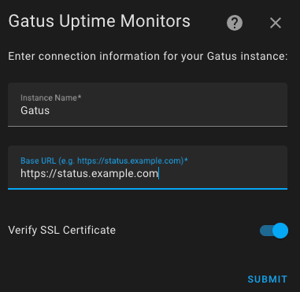

## Gatus Home Assistant Integrations

_Expose Your Gatus Uptime Checks as Sensors_

# Installation

While in development, this Integration can be added through HACS, by adding this repo as a [HACS custom repository](https://hacs.xyz/docs/faq/custom_repositories/).

# Configuration

Once Installed, Add via the Web UI in the Integrations Menu

- **Instance Name**: A unique name for your Gatus deployment. This is only used as the label for the Integration in Home Assistant.
- **Base URL**: The Base URL for your Gatus Deployment, Including the protocol (`http://` or `https://`, and if necessary the port.) Examples:
    - https://status.example.com
    - http://localhost:8080
- **Verify SSL**: Whether Home Assistant should verify that your SSL Certificate is valid (if using HTTPS).