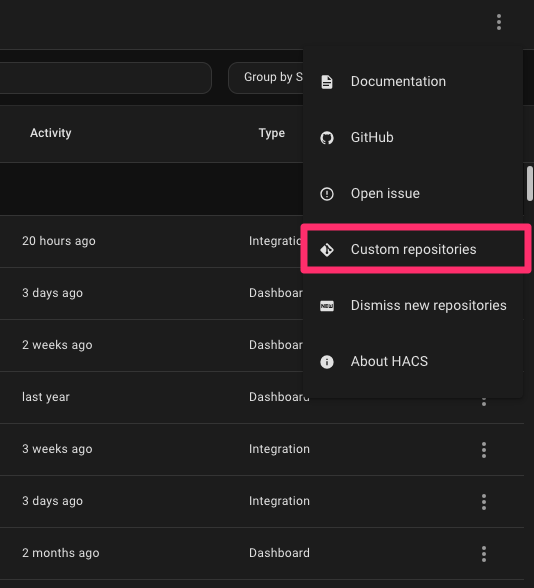
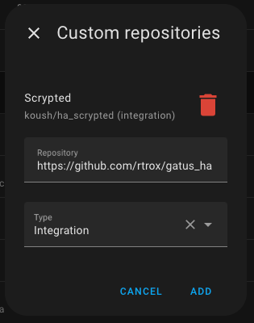
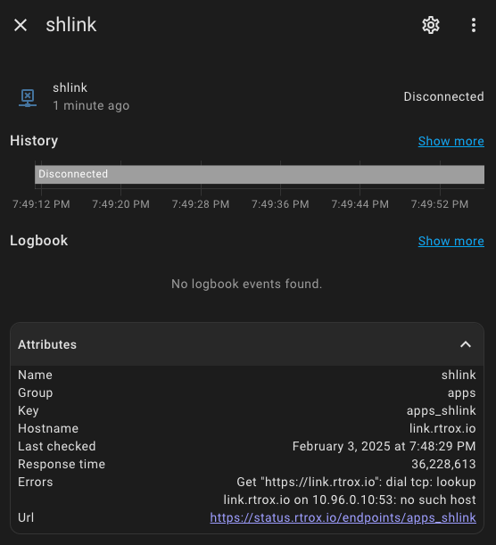

<h2>Gatus Home Assistant Integrations</h2>

_Expose Your Gatus Uptime Checks as Sensors_

# Installation

While in development, this Integration can be added through HACS, by adding this repo as a [HACS custom repository](https://hacs.xyz/docs/faq/custom_repositories/).

# Configuration

Once Installed, Add via the Web UI in the Integrations Menu

- **Instance Name**: A unique name for your Gatus deployment. This is only used as the label for the Integration in Home Assistant.
- **Base URL**: The Base URL for your Gatus Deployment, Including the protocol (`http://` or `https://`), and if necessary the port. Examples:
    - https://status.example.com
    - http://localhost:8080
- **Verify SSL**: Whether Home Assistant should verify that your SSL Certificate is valid (if using HTTPS).

# Sensors

This Integration will create a single Binary Sensor for each endpoint configured in your gatus instance, titled `binary_sensor.gatus_{key}`, where the key is the key in Gatus (it will be `{group}_{name}` if the Endpoint is in a group, or just `{name}` if it isn't.) Example: `binary_sensor.gatus_apps_shlink`. Each Binary Sensor will have the following attributes:

Attribute | Definition
---|---
Name | The Name as configured in Gatus
Group | The Gatus Group the Endpoint is in
Key | The endpoint key in the Gatus API for this endpoint (used in URLs)
Hostname | The Hostname or IP of the endpoint
Last Checked | When Gatus last checked the endpoint
Response time | How quickly the endpoint responded in the last check, in nanoseconds
Errors | Any errors returned if the check was not successful
Url | The direct link to the Gatus Page for this endpointgit com